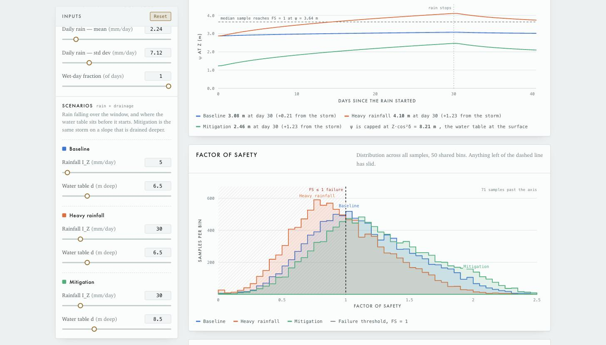
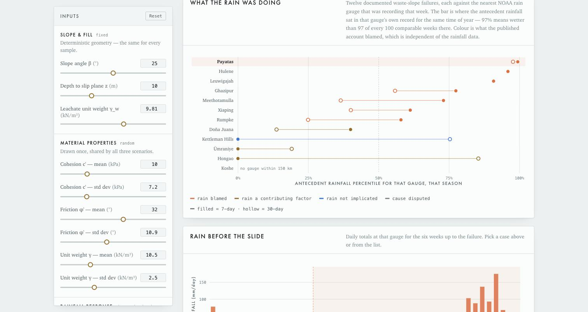
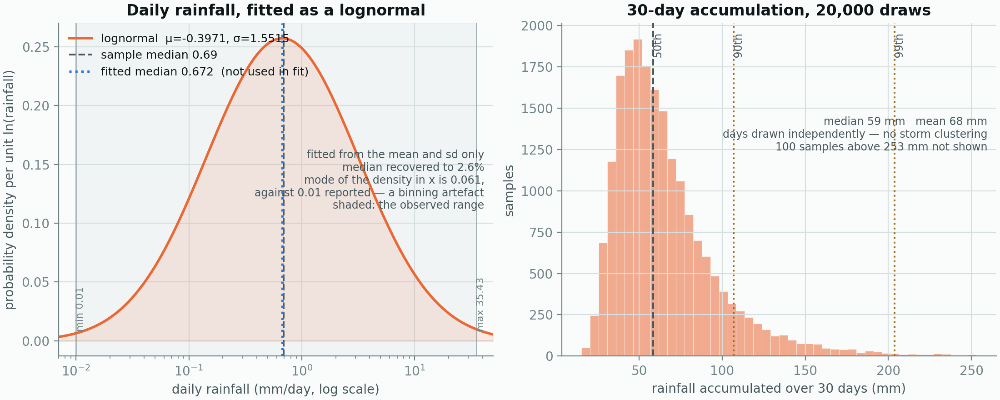

# Landfill slope stability — TRIGRS + Monte Carlo

A probabilistic slope-stability simulator for a lined landfill. Rainfall is pushed into
the waste with **TRIGRS v2.0** — the USGS transient infiltration model — and the pressure
head that reaches the slip surface is carried into the infinite-slope factor of safety.
It draws thousands of synthetic slopes, evaluates FS for each one, and reports how often
the slope fails under three scenarios: baseline, heavy rainfall, and a mitigation case
where the same storm falls on a slope that is drained deeper.

It also carries twelve real waste-slope failures with the rain that actually fell
before each one, measured at the nearest NOAA gauge, so the modelled response can be
read against something that happened.

**Live: [cee-110-project.vercel.app](https://cee-110-project.vercel.app)**


## Running it

Open `index.html` in any browser. There is no build step, no install, and no
dependencies — the page is a single self-contained file and never touches the network.

```
git clone https://github.com/Aaron-Zhang128/CEE-110-Project.git
cd CEE-110-Project
open index.html          # macOS; use `start` on Windows, `xdg-open` on Linux
```

`main` deploys to Vercel on push, so the live page is whatever is on `main`.

## The model

TRIGRS — *Transient Rainfall Infiltration and Grid-Based Regional Slope-Stability
Analysis*, version 2.0 (Baum, Savage & Godt, USGS Open-File Report 2008-1159) — in its
saturated form. Each day of rain enters as its own rainfall period, and the periods are
superposed through Iverson's (2000) linearised solution:

```
D_1     = D_0 / cos²δ                          diffusivity in the vertical
β       = cos²δ − I_ZLT/K_S                    steady-state gradient
Rf(τ)   = 2√(D_1·τ/π)·exp(−Z²/4D_1τ) − Z·erfc[ Z / 2√(D_1·τ) ]
ψ(Z,t)  = (Z − d)·β + Σ (I_n/K_S)·[ Rf(t−t_n) − Rf(t−t_n₊₁) ]
FS(Z,t) = tan φ′/tan δ + [ c′ − ψ·γ_w·tan φ′ ] / [ γ_s·Z·sin δ·cos δ ]
```

`Z` and `d` are vertical depths. Surface flux is capped at `K_S` and the excess runs off;
ψ is capped at `Z·cos²δ`, the water table standing at the ground surface. Above the water
table ψ goes negative — the saturated model reports that suction rather than solving the
unsaturated zone, which is TRIGRS's own caveat for this option. The slope has failed when
FS ≤ 1, and the probability of failure is the share of samples that get there.

The split between random and deterministic follows TRIGRS: hydraulic properties are grid
values, not random variables, so ψ is one number per scenario and the Monte Carlo runs
over strength alone.

| Variable | Kind | Default | Notes |
| --- | --- | --- | --- |
| Cohesion `c′` | lognormal | mean 10 kPa, sd 7.2 | stays positive, skews right |
| Friction angle `φ′` | normal | mean 32°, sd 10.9 | clipped to 1–50° |
| Unit weight `γ_s` | normal | mean 10.5 kN/m³, sd 2.5 | floored at 1 kN/m³ |
| Conductivity `K_S` | fixed | 1×10⁻⁵ m/s | also the infiltration capacity |
| Diffusivity `D_0` | fixed | 5×10⁻⁴ m²/s | `D_0/K_S` sets how fast the front arrives |
| Long-term flux `I_ZLT` | fixed | 1 mm/day | clamped below `K_S` |
| Water table `d` | fixed | 6.5 / 6.5 / 8.5 m deep | the mitigation lever |
| Rainfall `I_Z` | fixed | 5 / 30 / 30 mm/day | over the window |
| Slope angle `δ` | fixed | 25° | |
| Slip depth `Z` | fixed | 10 m | vertical depth |
| Water unit weight `γ_w` | fixed | 9.81 kN/m³ | |
| Window | fixed | 30 days | storm length and antecedent window |
| Daily rainfall | lognormal | mean 2.24 mm/day, sd 7.12 | site sample; drives the rainfall case |

Material properties are drawn **once** and shared by all three scenarios, so the only
thing separating them is the rain and the drainage — the comparison is a controlled one,
run on the same thousands of slopes wetter or better drained.

Because FS falls monotonically with ψ, every sample has a single pressure head at which it
reaches FS = 1. Those are computed and sorted once, so P(failure) at any head is a binary
search: the sensitivity curves are exact rather than resampled.

The random stream is seeded (default 42), so a given seed and sample count reproduce
exactly.

## What it shows



- **Cross-section** — drawn to the current geometry, with each scenario's pre-storm water
  table.
- **Scenario cards** — probability of failure, mean FS, failed-sample count, the pressure
  head at the slip surface, and the reliability index β = (mean FS − 1) / σ_FS, the margin
  to failure in standard deviations.
- **Pressure head through the storm** — ψ at the slip surface against time, one line per
  scenario, with the head at which the median sample reaches FS = 1. The head keeps
  climbing after the rain stops; that lag is what a prescribed head cannot show.
- **Factor of safety** — the three distributions on shared bins, with the FS = 1 threshold.
- **Sensitivity to rainfall** — failure probability as the storm intensity sweeps upward,
  one curve per water table, with each scenario marked. Curves flatten where ψ hits its
  ceiling at the ground surface.
- **Summary** — mean, median, standard deviation and 5th percentile FS per scenario.

Every input on the left is adjustable, including sample count (1 000–100 000) and seed;
everything recomputes as you drag.

## Site rainfall

The site's daily rainfall is supplied as summary statistics — mean 2.24 mm/day,
median 0.69, sd 7.12, min 0.01, max 35.43 — and fitted as a lognormal from the mean
and standard deviation alone. The fit predicts a median of 0.672 against the observed
0.69, 2.6% out, and it never saw the median. A gamma on the same two moments misses
it by 55×; an exponential is rejected by the coefficient of variation (3.18, not 1).

The page samples that distribution day by day across the window and pushes each day
through the same TRIGRS response used everywhere else, then reports the failure
probability on the baseline water table. With the defaults, a 30-day window gives a
median of about 58 mm and a median ψ rise of 0.08 m against a pre-storm 2.87 m — this
site's ordinary month barely moves the slope, and what risk there is lives in the tail.

Because the solution is linear in the rainfall intensities, the response collapses to one
weight per day of the window. Recent rain counts for more than old rain, and the weights
say by how much.

Two caveats are exposed as controls rather than buried: days are drawn independently,
so real storm clustering is not reproduced and the spread of the window total is a
floor; and if the sample counted rain days only, the wet-day fraction slider scales
the accumulation to match.

## The observed failures



Three further sections carry real data rather than simulated slopes:

- **What the rain was doing** — twelve documented waste-slope failures, ranked by where
  their antecedent rainfall sat in the nearest gauge's own record for that season.
  Colour marks what the published account blamed, which was assigned before any gauge
  was consulted.
- **Rain before the slide** — the daily hyetograph for the six weeks up to whichever
  failure is selected. Click a row in either section to change it.
- **Observed rainfall through the model** — each event's measured daily record fed into
  TRIGRS one day at a time, superposed at the failure date, and pushed through this
  slope's own failure curve.

Every day of the gauge record becomes a TRIGRS rainfall period, so the timing of the rain
matters and not only its total: 100 mm in the last week is not the same head as 100 mm
spread over the month. The window is adjustable from 3 to 45 days, and the rise is added
to the baseline scenario's water table, so the last column isolates what that rain
contributes on top of the standing head. This is still a model of the rain, not a
measurement of the waste — no gauge in the dataset measured the pressure head inside the
landfill, and the hydraulic properties are this page's defaults, not each site's.

Every failure whose published account blames rain sits at or above the 57th percentile
for 7-day antecedent rainfall. All four whose accounts blame something else — liner
interface shear at Kettleman Hills, a methane explosion at Ümraniye, leachate
recirculation at Doña Juana, static liquefaction of construction spoil at Hongao — sit
at the 40th or below, three of them at zero. Payatas, the deadliest, is also the
wettest: 588 mm in the preceding week, above the 97th percentile for that gauge.

With eleven gauged events and no control group of landfills that took the same rain and
held, this corroborates the published attributions. It does not establish a threshold,
and the page does not claim one.

Rainfall comes from NOAA GHCN-Daily and Global Summary of the Day, pulled live and
computed rather than transcribed. `data/` holds the case list, the generated rainfall
table, the puller, and a full data dictionary with the caveats that matter — gauge
distance, day-boundary offsets, missing days, and the one site (Koshe, Addis Ababa) with
no usable gauge within 150 km.

```
python3 data/build_antecedent_rainfall.py    # NOAA -> data/antecedent-rainfall.csv
python3 data/embed_cases.py                  # -> back into index.html
```

## Figures

The page is interactive; a report is not. `data/make_figures.py` draws the same three
charts as files, using pandas and matplotlib:

```
pip install pandas matplotlib
python3 data/make_figures.py                 # all three -> figures/
python3 data/make_figures.py --figure hyetograph --case leuwigajah2005
python3 data/make_figures.py --format pdf --dpi 300
```



## Notes

The "Acceptable / Marginal / High / Critical" labels on the scenario cards are a display
convention (≤ 1% / ≤ 5% / ≤ 15% / above), not a code requirement — adjust them to
whatever tolerable-risk threshold applies.

TRIGRS was built for shallow landslides, and at the default 10 m slip depth the transient
response is heavily damped: a month of ordinary site rain adds under a tenth of a metre of
head, while the standing water table supplies nearly three. That is a real property of the
model at this depth, not a defect — but it means the mitigation lever on this page is
drainage, and rainfall only moves the answer when it is extreme. Shorten `Z` or raise
`D_0` and the storm starts to dominate.

The page follows your system light or dark theme.

## References

- Baum, R.L., Savage, W.Z. & Godt, J.W. (2008). *TRIGRS — A Fortran Program for Transient
  Rainfall Infiltration and Grid-Based Regional Slope-Stability Analysis, Version 2.0*.
  U.S. Geological Survey Open-File Report 2008-1159.
- Iverson, R.M. (2000). Landslide triggering by rain infiltration. *Water Resources
  Research* 36(7), 1897–1910.
- NOAA GHCN-Daily and Global Summary of the Day, for all gauge rainfall.
- Per-failure sources are cited on each row of the case data in `data/landfill-failures.csv`.
